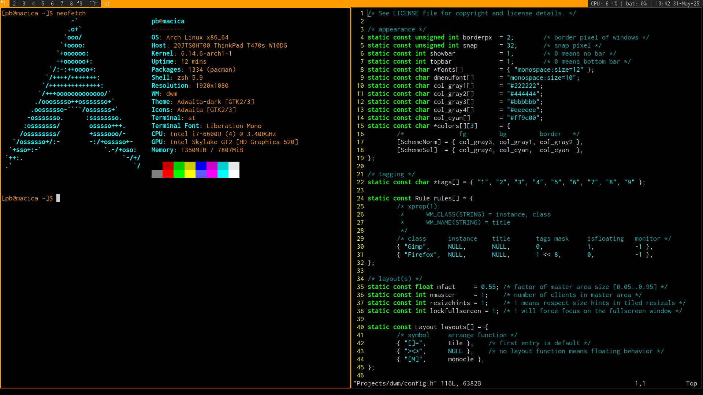

# dwm - dynamic window manager

dwm is an extremely fast, small, and dynamic window manager for X. This repo includes my minimalistically customized dwm configuration.



## Requirements

In order to build dwm you need the Xlib header files.


## Installation

1. Clone the repo:
```git clone https://github.com/braticpetar/dwm.git```

2. Edit config.mk to match your local setup (dwm is installed into
the /usr/local namespace by default).

3. Afterwards enter the following command to build and install dwm (if
necessary as root):
```make clean install```

4. **Run it** 


## Appearance

- Border width: 2 pixels
- Snap distance: 32 pixels
- Bar: Shown at the top
- Fonts: "monospace:size=12" for windows, "monospace:size=10" for dmenu
- Colors: Dark theme with grays (#222222, #444444, #bbbbbb, #eeeeee) and a highlight color (#ff9c00)
- Tagging: 9 tags ("1" to "9") for organizing windows

## Key Bindings

### Basic

- [Shift]+[Mod]+[Enter]   - launch terminal.

- [Mod]+[b]               - show/hide bar.
- [Mod]+[p]               - dmenu for running programs like the x-www-browser.
- [Mod]+[Enter]           - push acive window from stack to master, or pulls last used window from stack onto master.

- [Mod] + [j / k]         - focus on next/previous window in current tag.
- [Mod] + [h / l]         - increases / decreases master size.

### Navigation

- [Mod]+[2]               - moves your focus to tag 2.
- [Shift]+[Mod]+[2]       - move active window to the 2 tag.

- [Mod] + [i / d]         - increases / decreases number of windows on master
- [Mod] + [, / .]         - move focus between screens (multi monitor setup)
- [Shift]+[Mod]+[, / .]   - move active window to different screen.

- [Mod]+[0]               - view all windows on screen.
- [Shift]+[Mod]+[0]       - make focused window appear on all tags.
- [Shift]+[Mod]+[c]       - kill active window.
- [Shift]+[Mod]+[q]       - quit dwm cleanly.

### Layout

- [Mod]+[t]               - tiled mode. []=
- [Mod]+[f]               - floating mode. ><>
- [Mod]+[m]               - monocle mode. [M] (single window fullscreen)

### Floating

- [Mod]+[R M B]           - to resize the floating window.
- [Mod]+[L M B]           - to move the floating window around.
- [Mod]+[Space]           - toggles to the previous layout mode.
- [Mod]+[Shift]+[Space]   - to make an individual window float.
- [Mod]+[M M B]           - to make an individual window un-float. 
